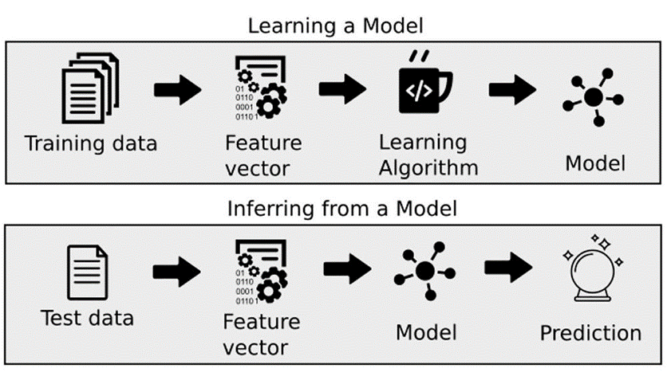

# Sistema de Recomendación de Videojuegos para Steam



## Descripción del Problema
La empresa Steam nos ha solicitado crear un sistema de recomendación de videojuegos para los usuarios. Nuestra meta es desarrollar un MVP (Producto Mínimo Viable) que proporcione recomendaciones personalizadas utilizando técnicas de Machine Learning.

## Conjunto de Datos
Los conjuntos de datos utilizados son el resultado del proceso ETL (Extracción, Transformación y Carga) y se encuentran en la carpeta `Dataset`. Los datos originales no se subieron por cuestiones prácticas. Los datasets procesados son:

### ETL_games_clean
Este archivo parquet contiene:
- `Genres`: Género del juego.
- `Title`: Nombre del juego.
- `release_date`: Año de lanzamiento del juego.
- `Price`: Valor monetario del juego.
- `item_id`: ID del juego.
- `developer`: Desarrollador del juego.

### ETL_items_clean
Este archivo parquet contiene:
- `item_id`: ID del juego.
- `item_name`: Nombre del juego.
- `playtime_forever`: Tiempo total jugado por el usuario.
- `user_id`: ID del usuario.
- `items_count`: Cantidad de ítems (juegos) que tiene el usuario.

### ETL_user_reviews_clean
Este archivo parquet contiene:
- `user_id`: ID del usuario.
- `item_id`: ID del juego.
- `reviews_recommend`: Reseñas.
- `reviews_date`: Fecha de la reseña.
- `sentiment_analysis`: Reseña positiva, neutra o negativa.

## Explicación del Repositorio
En la carpeta `Dataset` se encuentran los siguientes archivos y notebooks:

- **Modelo_datos**: Notebook que contiene la información para el `df_recomendacion` (modelo de recomendación de juegos).
- **ETL_user_reviews_clean, ETL_games_clean, ETL_items_clean**: Archivos parquet con los datos limpios.
- **EDA**: Notebook donde se desarrolla un análisis exploratorio de los datos (EDA).

## Funcionalidades
Proponemos las siguientes consultas a través de una API creada con FastAPI y desplegada usando RENDER:

### `developer( desarrollador: str )`
Devuelve la cantidad de ítems y el porcentaje de contenido gratuito por año según la empresa desarrolladora.

**Ejemplo de retorno:**
```
[
  {"Año": 2023, "Cantidad de Items": 50, "Contenido Free": "27%"},
  {"Año": 2022, "Cantidad de Items": 45, "Contenido Free": "25%"},
  {"Año": xxxx, "Cantidad de Items": xx, "Contenido Free": "xx%"}
]
```
### userdata(User_id: str)
Devuelve la cantidad de dinero gastado por el usuario, el porcentaje de recomendación basado en `reviews.recommend` y la cantidad de ítems.

**Ejemplo de retorno:**
```
{
  "Usuario X": "us213ndjss09sdf",
  "Dinero gastado": "200 USD",
  "% de recomendación": "20%",
  "cantidad de items": 5
}
```

### UserForGenre(genero: str)
Devuelve el usuario que acumula más horas jugadas para el género dado y una lista de la acumulación de horas jugadas por año de lanzamiento.

**Ejemplo de retorno:**
```
{
  "Usuario con más horas jugadas para Género X": "us213ndjss09sdf",
  "Horas jugadas": [
    {"Año": 2013, "Horas": 203},
    {"Año": 2012, "Horas": 100},
    {"Año": 2011, "Horas": 23}
  ]
}
```

### developer_reviews_analysis(desarrolladora: str)
Devuelve un diccionario con el nombre del desarrollador como llave y una lista con la cantidad total de registros de reseñas de usuarios categorizados con un análisis de sentimiento como valor positivo o negativo.

**Ejemplo de retorno:**
```
{
  "Valve": {"Negative": 182, "Positive": 278}
}
```
## Análisis Exploratorio de Datos (EDA)

Realizaremos el EDA para entender las relaciones entre las variables del dataset, identificar outliers o anomalías, y descubrir patrones interesantes. El análisis incluirá:

- Los cinco juegos más jugados.
- Los cinco géneros más populares.
- El top diez de los desarrolladores con más juegos.
- Visualización del análisis del sentimiento.
- Tendencia de aumento de reviews después del año 2013, mostrando un gran crecimiento en la participación social de la industria de juegos.

### Modelo de Machine Learning
Entrenaremos nuestro modelo de Machine Learning usando la herramienta de similitud del coseno para desarrollar un sistema de recomendación item-item.

## recomendacion_juego(id de producto: str)
Ingresando el ID del producto, devuelve una lista con 5 juegos recomendados similares al ingresado.

**Ejemplo de retorno:**
```
{
  "Juegos recomendados": [
    "Call of Duty®: Modern Warfare® 2",
    "Call of Duty®: Modern Warfare® 3",
    "Medal of Honor™",
    "Call of Duty®",
    "Call of Duty®: Black Ops"
  ]
}
```
## Recursos
- [FastAPI](https://fastapi.tiangolo.com/tutorial/)
- [RENDER](https://github.com/HX-FNegrete/render-fastapi-tutorial) 
- [Similitud_del_coseno](https://youtu.be/7nago29IlxM)
- [EDA](https://medium.com/swlh/introduction-to-exploratory-data-analysis-eda-d83424e47151)
